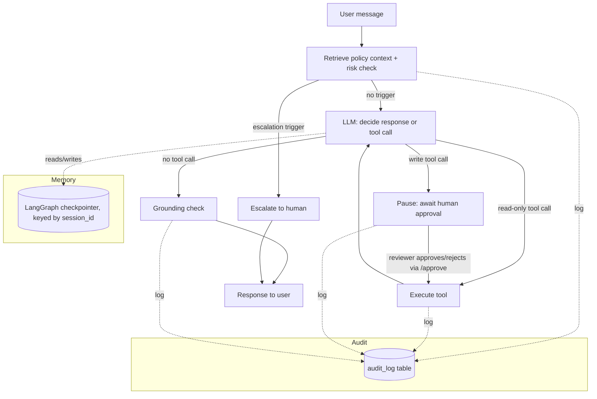

# Support Agent Demo

A customer-support AI agent that **takes real actions**, not just answers questions --
built to demonstrate the specific pattern that comes up repeatedly in production
agentic-AI work: tool-calling with guardrails, retrieval-grounded answers,
human-in-the-loop approval on write actions, multi-turn memory, and human
escalation when a case is out of scope.

**Live demo:** _add your deployed URL here_
**Walkthrough video:** _add your 60-90s Loom/YouTube link here_

## What it does

- Looks up order status, checks refund eligibility, and creates support tickets
  by calling real (mocked) internal tools -- it doesn't just generate text.
- Answers policy questions (shipping, returns, account) grounded in a small
  retrieval-augmented knowledge base, so it can't invent policy that doesn't exist.
- **Pauses for human approval before any write action** (e.g. creating a ticket)
  and only executes once a reviewer approves -- directly implements the
  "AI must never create/update/delete records without sign-off" governance
  pattern that shows up repeatedly in enterprise client requirements. Nothing
  is written to the database until a human says yes.
- **Remembers the conversation across turns** via a LangGraph checkpointer keyed
  on session ID, so follow-up questions ("what about that order I just asked
  about") work correctly instead of every message being stateless.
- Escalates to a human when the conversation shows risk signals: angry sentiment,
  legal language, or a refund above a configurable threshold.
- Runs a grounding check on its own final response before returning it, flagging
  any claim not backed by real tool output.
- Logs every decision -- tool call, guardrail block, approval, escalation,
  response -- to an audit trail, queryable per conversation.
- Exposes an `n8n`-compatible webhook, so the same agent can sit behind a
  no-code automation workflow instead of only a custom frontend.

## Architecture



Everything above is implemented as a LangGraph state graph (`app/agent.py`),
compiled with `interrupt_before=["await_approval"]` so execution genuinely
pauses (and persists via the checkpointer) before any write action runs --
this isn't a UI-only illusion, the graph really stops mid-execution and
resumes exactly where it left off once `/approve/{session_id}` is called.
The same shape maps directly onto Google ADK's agent/tool pattern -- LangGraph
was chosen here because it's the most commonly requested framework in client
job postings, not because the architecture is framework-specific.

## Stack

| Layer          | Choice                          | Why |
|----------------|----------------------------------|-----|
| API            | FastAPI                         | async, auto-docs at `/docs` |
| Agent          | LangGraph + Claude               | tool-calling loop with explicit guardrail + approval nodes |
| Memory         | LangGraph `MemorySaver` checkpointer | multi-turn conversation state, keyed by session_id (swap for `SqliteSaver` to survive restarts) |
| Storage        | SQLite (swap `DATABASE_URL` for Postgres/Neon) | zero external dependency, no region-block risk |
| Retrieval      | scikit-learn TF-IDF              | no embedding-model download at runtime, deploys fast |
| Frontend       | Plain HTML/JS chat widget         | embeddable in one file, includes an Approve/Reject UI for the HITL flow |
| Automation hook| `/webhook/n8n` endpoint           | bridges custom-agent and no-code-automation client requests |

## Running locally

```bash
git clone <this-repo>
cd support-agent
python -m venv venv && source venv/bin/activate
pip install -r requirements.txt
cp .env.example .env   # then add your ANTHROPIC_API_KEY
uvicorn app.main:app --reload
```

Open http://localhost:8000 for the chat widget, or drive it directly:

```bash
# Read-only tool call -- executes immediately
curl -X POST http://localhost:8000/chat \
  -H "Content-Type: application/json" \
  -d '{"message": "Where is order ORD-1001?"}'

# Write action -- pauses for approval. Response includes pending_approval + session_id.
curl -X POST http://localhost:8000/chat \
  -H "Content-Type: application/json" \
  -d '{"message": "My chair from ORD-1003 arrived damaged, open a ticket", "session_id": "demo-1"}'

# Resume: approve or reject the pending action
curl -X POST http://localhost:8000/approve/demo-1 \
  -H "Content-Type: application/json" \
  -d '{"approved": true}'
```

Try these in the chat widget to see each capability:
- `"Where is order ORD-1001?"` -> tool call, executes immediately (read-only)
- `"My chair from ORD-1003 arrived damaged, open a ticket"` -> pauses, shows an
  Approve/Reject card in the UI -- nothing is written until you click Approve
- `"I want a refund on ORD-1004, this is unacceptable"` -> escalation (sentiment trigger)
- `"What's your return policy for damaged items?"` -> RAG-grounded answer
- Ask a follow-up in the same session (e.g. "is that the one I just asked about?")
  to see conversation memory working across turns

## Tests

```bash
pytest tests/ -v
```

15 tests: guardrail logic, tool behavior, and -- notably -- the LangGraph
plumbing itself (`tests/test_agent_flow.py`), using a scripted fake LLM so the
pause/approve/resume cycle and multi-turn memory are verified against real
graph execution, not just guardrail functions in isolation. No API key or
network access required to run any of these.

## Deployment

**Render** (recommended, simplest): connect this repo, Render will pick up
`render.yaml` automatically. Add your `ANTHROPIC_API_KEY` as a secret env var
in the dashboard. Free tier works but sleeps after ~15 min idle (cold start
~20-40s); upgrade to the Starter plan (~$7/mo) for always-on.

**Fly.io**: `fly launch --no-deploy`, review the generated config against
`fly.toml`, then `fly secrets set ANTHROPIC_API_KEY=...` and `fly deploy`.

Both configs default to SQLite on local disk and an in-memory checkpointer,
which is fine for a demo but resets on redeploy or restart -- swap
`DATABASE_URL` for a hosted Postgres (Neon's free tier is a good, unblocked
choice) and swap `MemorySaver` for `SqliteSaver`/a Postgres checkpointer if
you want data and conversation memory to persist long-term.

## n8n integration

Point an n8n HTTP Request node at `POST /webhook/n8n` with header
`X-Webhook-Secret: <your N8N_WEBHOOK_SECRET>` and body `{"message": "..."}`.
Same agent, same guardrails, same approval gate, reachable from a no-code workflow.

## Notes on what's real vs. mocked

- Orders/tickets are seeded mock data (`app/seed.py`) standing in for a real
  CRM/order-management system -- the tool functions are the integration point;
  swapping them to call a real API is a matter of changing the function body,
  not the agent architecture.
- The grounding check (`app/guardrails.py::check_grounding`) is a demo-grade
  heuristic (flags unsupported dollar amounts), not a production hallucination
  detector -- the point being demonstrated is that a grounding check exists in
  the pipeline at all, which is what several client postings explicitly asked for.
- The human-in-the-loop approval gate currently requires a manual `/approve`
  call (or the button in the demo UI) -- in a real deployment this would notify
  an actual reviewer (Slack message, email, admin dashboard) rather than
  relying on someone watching the API.
