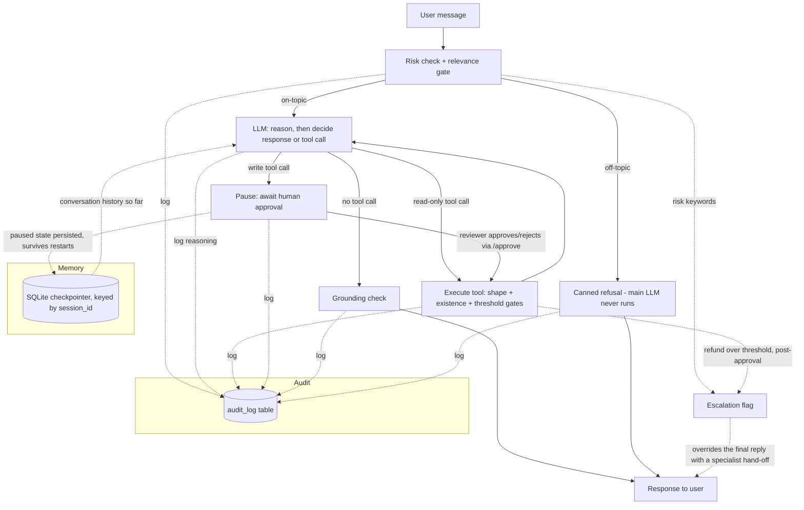

# LangGraph Support Agent

A customer-support AI agent that **takes real actions**, not just answers questions:
tool-calling with guardrails, retrieval-grounded answers, human-in-the-loop
approval on write actions, multi-turn memory, and escalation to a human when a
case is out of scope.

The design rule throughout: **the model decides what the customer means; the code
decides what is allowed to happen.** Reads run freely, writes require human
sign-off, and every consequential step is enforced deterministically rather than
left to the model's judgement.

**Live demo:** https://support-agent-demo.onrender.com — free tier, first
request after idle takes ~30-60s to wake, then it's fast.
**Walkthrough video:** _add your 60-90s Loom/YouTube link here_

## What it does

- Looks up order status, checks refund eligibility, and creates support tickets
  by calling real (mocked) internal tools -- it doesn't just generate text.
- Answers policy questions (shipping, returns, account) grounded in a small
  retrieval-augmented knowledge base, so it can't invent policy that doesn't exist.
- **Pauses for human approval before any write action** (e.g. creating a ticket)
  and only executes once a reviewer approves -- the "AI must never
  create/update/delete records without sign-off" governance pattern. Nothing
  is written to the database until a human says yes.
- **Remembers the conversation across turns** via a LangGraph checkpointer keyed
  on session ID, so follow-up questions ("what about that order I just asked
  about") work correctly instead of every message being stateless.
- **Rejects off-topic queries before the main LLM ever runs** -- a relevance
  gate (a cheap, fast classifier model) checks every message against the
  support domain, so "write me a python script" gets a polite canned refusal
  instead of burning tokens, and the endpoint can't be repurposed as a free
  LLM proxy. Fails open: if the gate model errors, the query still goes through.
- Escalates to a human when the conversation shows risk signals: angry sentiment,
  legal language, or a refund above a configurable threshold.
- Runs a grounding check on its own final response before returning it, flagging
  any claim not backed by real tool output.
- Logs every decision -- tool call, guardrail block, approval, escalation,
  response -- to an audit trail, queryable per conversation. The bundled web UI
  renders it live in a "behind the scenes" panel next to the chat, so you can
  watch the pipeline work in real time.
- Exposes an `n8n`-compatible webhook, so the same agent can sit behind a
  no-code automation workflow instead of only a custom frontend.

## Architecture



Every node's state is checkpointed, which is why a conversation resumes across
separate HTTP requests and why a paused approval survives a restart.

Note that escalation does **not** short-circuit the graph: an escalating message
still runs the model and its tools (so the specialist inherits a full audit trail
and any lookups already done), and the escalation flag then overrides the
customer-facing reply. It can be raised in two places -- risk keywords before the
model runs, and the hard refund-amount check, which fires only after a write is
approved.

Everything above is implemented as a LangGraph state graph (`app/agent.py`),
compiled with `interrupt_before=["await_approval"]` so execution genuinely
pauses (and persists via the checkpointer) before any write action runs --
this isn't a UI-only illusion, the graph really stops mid-execution and
resumes exactly where it left off once `/approve/{session_id}` is called.

The graph is hand-built rather than using LangGraph's prebuilt
`create_react_agent`, because the governance lives in seams the prebuilt doesn't
expose: a gate *before* the model runs, deterministic checks *between* a proposed
action and its execution, and a grounding check *after* the final answer. Most
decisively, the prebuilt's `interrupt_before=["tools"]` is all-or-nothing --
"reads run free, writes need sign-off" can't be expressed with it.

## Stack

| Layer          | Choice                          | Why |
|----------------|----------------------------------|-----|
| API            | FastAPI                         | async, auto-docs at `/docs` |
| Agent          | LangGraph, provider-switchable LLM (`LLM_PROVIDER`: Groq llama-3.3-70b default, or Gemini / Claude) | ReAct tool-calling loop with explicit guardrail + approval nodes; the provider is one env var, so the architecture isn't married to a vendor |
| Relevance gate | Separate small model (Groq llama-3.1-8b-instant) | topic classification is too fuzzy for keywords; a cheap second model gates traffic without touching the main model's rate limits |
| Memory         | LangGraph `SqliteSaver` checkpointer | multi-turn conversation state AND paused approvals survive server restarts, keyed by session_id |
| Storage        | SQLite (swap `DATABASE_URL` for Postgres/Neon) | zero external dependency, no region-block risk |
| Retrieval      | scikit-learn TF-IDF              | no embedding-model download at runtime, deploys fast |
| Frontend       | Plain HTML/JS, chat + live audit panel | single file, Approve/Reject cards for the HITL flow, real-time audit trail visualization |
| Automation hook| `/webhook/n8n` endpoint           | the same agent is callable from a no-code workflow, not just a custom frontend |

## Running locally

```bash
git clone https://github.com/Obi-Uno/langgraph-support-agent.git
cd langgraph-support-agent
python -m venv venv && source venv/bin/activate   # Windows: venv\Scripts\activate
pip install -r requirements.txt
cp .env.example .env   # then set GROQ_API_KEY (free at console.groq.com)
uvicorn app.main:app --reload
```

The default `.env.example` uses Groq's free tier (`LLM_PROVIDER=groq`). To run
on Gemini or Claude instead, flip `LLM_PROVIDER` and fill the matching API key.

Open http://localhost:8000 for the chat widget, or drive it directly:

```bash
# Read-only tool call -- executes immediately
curl -X POST http://localhost:8000/chat \
  -H "Content-Type: application/json" \
  -d '{"message": "Where is order ORD-1001?"}'

# Write action -- pauses for approval. Response includes pending_approval + session_id.
curl -X POST http://localhost:8000/chat \
  -H "Content-Type: application/json" \
  -d '{"message": "My chair from ORD-1003 arrived damaged, open a ticket", "session_id": "session-1"}'

# Resume: approve or reject the pending action
curl -X POST http://localhost:8000/approve/session-1 \
  -H "Content-Type: application/json" \
  -d '{"approved": true}'
```

Try these in the chat widget to see each capability:
- `"Where is order ORD-1001?"` -> tool call, executes immediately (read-only)
- `"My chair from ORD-1003 arrived damaged, open a ticket"` -> pauses, shows an
  Approve/Reject card in the UI -- nothing is written until you click Approve
- `"I want a refund on ORD-1004, this is unacceptable"` -> escalation (sentiment trigger)
- `"What's your return policy for damaged items?"` -> RAG-grounded answer
- `"What's a good pasta recipe?"` -> blocked by the relevance gate, main LLM never runs
- Ask a follow-up in the same session (e.g. "is that the one I just asked about?")
  to see conversation memory working across turns

Watch the "behind the scenes" panel while you do -- every guardrail decision,
tool call, pause and approval appears in the audit trail as it happens.

## Tests

```bash
pytest tests/ -v
```

32 tests: guardrail logic (including the relevance gate's block, pass and
fail-open paths), the deterministic gates (argument shape, look-before-write,
refund threshold), the typed approve/reject classifier's boundaries, tool
behavior, and -- notably -- the LangGraph plumbing
itself (`tests/test_agent_flow.py`), using scripted fake LLMs so the
pause/approve/resume cycle and multi-turn memory are verified against real
graph execution, not just guardrail functions in isolation. No API key or
network access required to run any of these.

## Deployment

**Render** (recommended, simplest): connect this repo, Render will pick up
`render.yaml` automatically. Add your `GROQ_API_KEY` as a secret env var
in the dashboard. Free tier works but sleeps after ~15 min idle (cold start
~20-40s); upgrade to the Starter plan (~$7/mo) for always-on.

**Fly.io**: `fly launch --no-deploy`, review the generated config against
`fly.toml`, then `fly secrets set GROQ_API_KEY=...` and `fly deploy`.

Conversation state (including paused approvals) persists in a SQLite-backed
checkpointer, so it survives server restarts out of the box. Note that free
hosting tiers use ephemeral disks: a *redeploy* resets both SQLite files
(orders reseed automatically on startup). For long-term persistence swap
`DATABASE_URL` for a hosted Postgres (Neon's free tier is a good, unblocked
choice) and the checkpointer for its Postgres equivalent.

## n8n integration

Point an n8n HTTP Request node at `POST /webhook/n8n` with header
`X-Webhook-Secret: <your N8N_WEBHOOK_SECRET>` and body `{"message": "..."}`.
Same agent, same guardrails, same approval gate, reachable from a no-code workflow.

## Notes on what's real vs. mocked

- Orders/tickets are seeded mock data (`app/seed.py`) standing in for a real
  CRM/order-management system -- the tool functions are the integration point;
  swapping them to call a real API is a matter of changing the function body,
  not the agent architecture.
- The grounding check (`app/guardrails.py::check_grounding`) is a deliberately
  simple heuristic (flags dollar amounts unsupported by tool output), not a
  production hallucination detector -- it demonstrates where such a check
  belongs in the pipeline.
- The human-in-the-loop approval gate requires a manual `/approve` call (or the
  button in the web UI). A production deployment would notify a real reviewer
  (Slack, email, an admin dashboard) rather than relying on someone watching
  the API.
- The public endpoints have no authentication or rate limiting beyond the
  webhook's shared secret; both would be prerequisites for real traffic.
